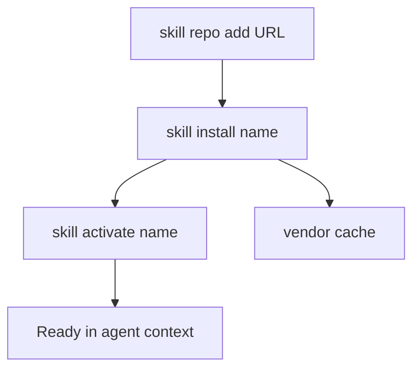

**English** | [Русский](/ru/docs/skill-ecosystem)

# Skill ecosystem — one-page map

Single entry point for **vendor / repo skills** (not the 13 core slash skills + `/brain` conditional in `harness/skills/` — those ship with TAUSIK and are documented in **[Skills](skills.md)**).

## Flow (install path)

**CLI steps** (mirror of [CLI — Skills](cli.md#skills); run via `.tausik/tausik`):

1. **`skill repo add <url>`** — register a TAUSIK-compatible repo (`tausik-skills.json` / legacy `skills.json`).
2. **`skill install <name>`** — clone if needed, copy skill files, install declared pip dependencies.
3. **`skill activate <name>`** — promote an installed skill into the IDE skill load path (see [Vendor skills — three tiers](vendor-skills.md#three-tier-skill-system)).
4. **`skill list`** — see active, vendored, and available skills.

**Deactivate / remove:** `skill deactivate <name>` · `skill uninstall <name>` · `skill repo remove <name>` (see CLI reference).

## Risks

- **`skill repo add`** without **`--force`** only succeeds for the official **Kibertum/tausik-skills** URL; third-party repos require an explicit opt-in after review ([Vendor skills — Repo trust](vendor-skills.md#repo-trust-force)).
- External repos run **arbitrary instructions** in `SKILL.md` and may execute scripts during install. Treat unknown repos like untrusted code. Details: **[Vendor skills](vendor-skills.md)** (security & trust).
- **Context budget:** each *active* skill consumes prompt space; keep only frequently used skills activated.

## Claude-native sub-agents

Beyond slash skills, TAUSIK ships **named sub-agents** that the Agent tool can invoke directly (`Agent(subagent_type="<name>", ...)`). They live under `harness/claude/subagents/` in the source tree and bootstrap deploys them to `.claude/agents/`. Cursor / Qwen do not have a named-subagent concept — these are Claude-only.

| Sub-agent | Invoked by | What it does |
|-----------|------------|--------------|
| `tausik-reviewer` | `/review lite` | Single-pass code review with the SENAR 28-item checklist + security docs. Returns structured JSON `{critical[], high[], medium[], low[]}` so the main context never sees per-file reads or per-agent prose. ~2.9KB definition; rubric loaded at runtime. Token-economy alternative to the default 6-agent fork — pick it for low-stakes diffs and skip it for security-sensitive code. |
| `tausik-gate-fixer` | `/debug` (auto-helper after a failed `tausik verify`) | Reads the gate's stderr + project troubleshooting docs, returns a 1-3 step JSON fix plan `{gate, family, plan: [{step, action, target, change, why}], meta}`. Read-only PLAN agent — never applies edits; the invoker applies the plan and re-runs `tausik verify`. Action vocabulary is fixed (`edit`, `extract_module`, `add_test`, `move_file`, `delete_dead_code`, `re_run_gate`). |

Adding a sub-agent: drop `<name>.md` (with frontmatter `name`, `description`, `tools`, `model`) into `harness/claude/subagents/`, then `python bootstrap/bootstrap.py --ide claude` re-deploys it. Tools should be minimal — read-only sub-agents (`Read, Grep, Bash`) keep the trust surface small.

## Where to go next

| Topic | Document |
|-------|----------|
| Repo format, pip deps, `tausik-skills.json` | [Vendor skills](vendor-skills.md) |
| Slash skills `/plan`, `/ship`, core 13 | [Skills](skills.md) |
| IDE-specific skill paths | [Skill adaptation](skill-adaptation.md) |
| MCP tool names for agents | [MCP](mcp.md) — `tausik_skill_*` |
