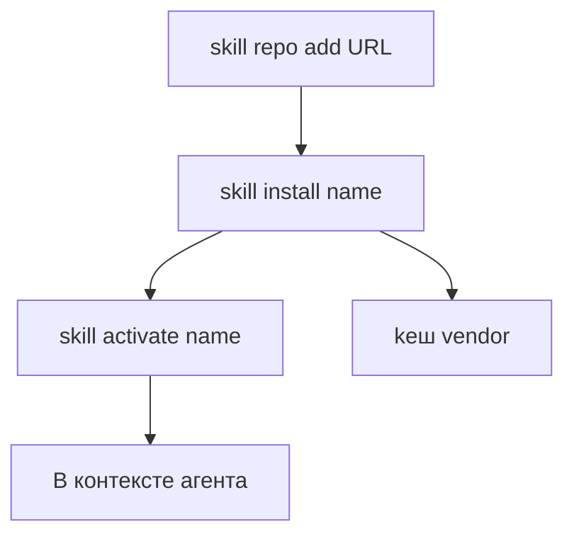

**Русский** | [English](/docs/skill-ecosystem)

# Экосистема скиллов — карта на одной странице

Точка входа для **внешних / репозиторных** скиллов (не 13 core slash-скиллов + `/brain` conditional в `harness/skills/` — они в **[Навыки](skills.md)**).

## Поток (установка)

**Шаги CLI** (как в [CLI — Навыки](cli.md#навыки); вызов через `.tausik/tausik`):

1. **`skill repo add <url>`** — зарегистрировать repo с `tausik-skills.json` (или legacy `skills.json`).
2. **`skill install <name>`** — при необходимости clone, копирование, pip-зависимости.
3. **`skill activate <name>`** — подключить установленный скилл в путь загрузки IDE (три уровня: **[Vendor skills](vendor-skills.md)**).
4. **`skill list`** — активные, vendored и доступные из repo.

**Отключение / удаление:** `skill deactivate` · `skill uninstall` · `skill repo remove` — см. справочник CLI.

## Риски

- Без **`--force`** команда **`skill repo add`** принимает только официальный URL **Kibertum/tausik-skills**; для сторонних репо нужен явный opt-in после ревью ([Внешние скиллы — доверие к репо](vendor-skills.md#доверие-к-репо-force)).
- Внешние репозитории содержат **произвольные инструкции** в `SKILL.md` и могут запускать код при установке. Подробнее: **[Внешние скиллы](vendor-skills.md)**.
- **Бюджет контекста:** каждый *активный* скилл занимает место в промпте.

## Claude-native sub-agents

Помимо slash-скиллов TAUSIK поставляет **именованные sub-agents**, которые тулза `Agent` может вызывать напрямую (`Agent(subagent_type="<name>", ...)`). Исходники в `harness/claude/subagents/`, bootstrap раскладывает их в `.claude/agents/`. Cursor / Qwen концепции named-subagent не имеют — это Claude-only.

| Sub-agent | Кем вызывается | Что делает |
|-----------|----------------|-----------|
| `tausik-reviewer` | `/review lite` | Однопроходный код-ревью по 28-item SENAR checklist + security docs. Возвращает структурированный JSON `{critical[], high[], medium[], low[]}`, чтобы основной контекст не видел построчных чтений и многословных отчётов. ~2.9 KB определения; rubric читается в runtime. Token-economy альтернатива дефолтному форку из 6 агентов — выбирай для diff'ов с низкой ставкой и не используй для security-sensitive кода. |
| `tausik-gate-fixer` | `/debug` (auto-helper после failed `tausik verify`) | Читает stderr упавшего gate + troubleshooting-документы, возвращает 1-3 шаговый JSON fix plan `{gate, family, plan: [{step, action, target, change, why}], meta}`. Read-only PLAN-агент — никогда не правит сам; вызывающий применяет plan и перезапускает `tausik verify`. Action vocabulary фиксированный (`edit`, `extract_module`, `add_test`, `move_file`, `delete_dead_code`, `re_run_gate`). |

Добавить sub-agent: положи `<name>.md` (с frontmatter `name`, `description`, `tools`, `model`) в `harness/claude/subagents/`, затем `python bootstrap/bootstrap.py --ide claude` пересобирает раскладку. Tools держи минимальными — read-only sub-agents (`Read, Grep, Bash`) сужают доверительную поверхность.

## Куда дальше

| Тема | Документ |
|------|----------|
| Формат репо, pip, `tausik-skills.json` | [Vendor skills](vendor-skills.md) |
| Core slash-скиллы | [Навыки](skills.md) |
| Пути под IDE | [Адаптация скиллов](skill-adaptation.md) |
| MCP `tausik_skill_*` | [MCP](mcp.md) |
